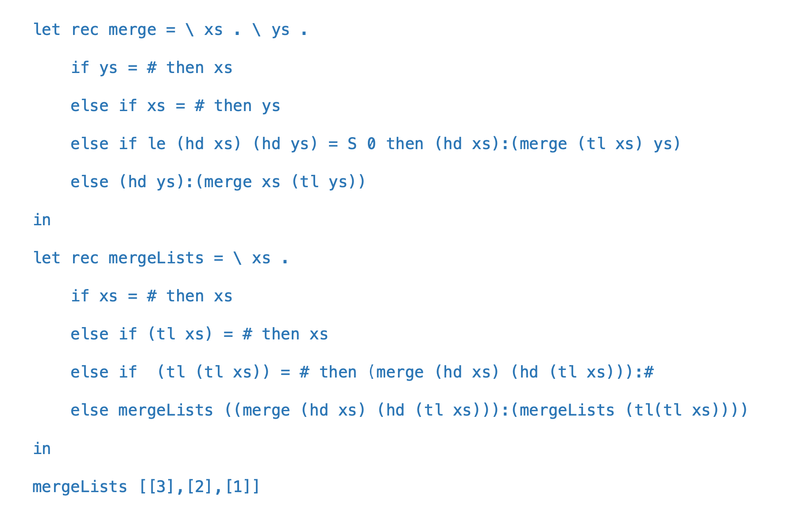

# Investigating Merge and Merge List

When doing the assignment wtih merge and mergeList I ran into many issues. A lot of them had to do with how to properly insert into lists inside of lists. Having taken a look at the code that you sent with the take home final on how to do this properly, I thought it would be a good idea to investigate how exactly you made this code work

First lets look at your code:



**Let's start with merge.** The merge function merges two lists together sorted but how?

Well first we check the base cases

```
    if ys = # then xs
    else if xs = # then ys
```

These are just saying if either list is empty return the other list

Now lets go to the third line:

```
else if le (hd xs) (hd ys) = S 0 then (hd xs):(merge (tl xs) ys)
```

This line says if the head of the first list is small than or equal to the head of the second list then concatinate the head of the first list (so just the number), with a recursive call of merge of the tail of the first list with the entire second list

Finally lets look at the last line

```
else (hd ys):(merge xs (tl ys))
```

this line runs essentialy if whats in the first list is greater than whats in the second list , it then concatinates the head of the second list with the recursive call of merge on the first list and the tail of the second list

**Now that we undertsand that lets move on to mergeList.** This essentially makes a list of lists into a list (sorted).

lets first look at the two base cases
```
    if xs = # then xs
    else if (tl xs) = # then xs
```

The first one just checks if the list is empty, the second one checks if the tale of the list is empty, in both of these cases it just returns the list back

Now lets look at the third line:
```
 else if  (tl (tl xs)) = # then (merge (hd xs) (hd (tl xs))):#
```

This line basically checks if the tail of the tail of the list (so just the number value) is equal to empty, if this is the case it uses the merge function to merge the head of the list and the head of the tail of the list and then concatinate that with an emoty list. This line ends the recursive loop

Finally lets look at the fourth line:
```
else mergeLists ((merge (hd xs) (hd (tl xs))):(mergeLists (tl(tl xs))))
```

The line runs a recursive call on a merge of the head of th e list and the head of the tail of the list, it then concatinates this with another recursive call of mergelistis on the tail of the tail of the list (the number value)

From going through this program step by step I know clearly understand what it is doing and how it is written!