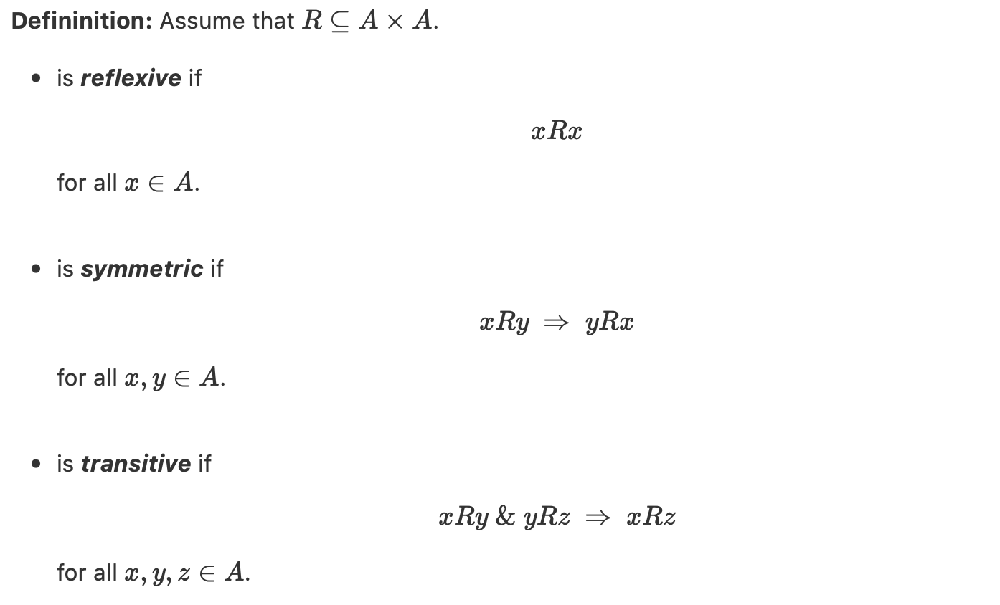
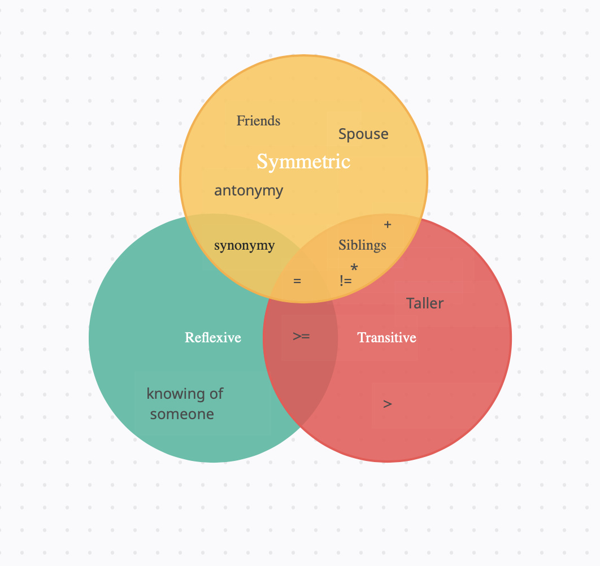

# Guide to Understanding Reflexive, Symetric and Transitive

The concepts of reflexivism, symetrisim, and transitivism is a concept that is crucial for understanding Abstract Reduction systems so it is important that we understand what they mean

### So first lets define them:

As given from Kurz lecture notes these are the definition of reflexive, symetric, and transitive:

While this is helpful to see what these three terms are defined as what was more useful to me was seeing the examples of what things fit into these categories. That is what really helped me understand this concept. So in order to be able to make this even easier for others to understand I have provided this Ven Diagram that I made of what exactly constitutes what

Now so that you properly understand this diagram lets go through a few examples from it. Lets look at friends, why is friends only in the Symettric bubble? Well lets just think about it... can you be friends with yourself? No, not really so it is not reflexive. If you are friends with someone who is a friend with another person does that mean you are friends with that other person? No, not necesserily, so that's why its not transitive. However, if you are friends with someone, it can be assumed that they are friends with you because that is the nature of a friendship, so therefore it is transitive

Lets look at one more example just to make sure everything is clear. Why is equal all three of the properties. Well lets take an example. Lets start with the number 5

is 5 = 5?

**yes!** so it is reflexive

if 5 is = 2 + 3 then is 2 + 3 = 5?

**yes!** so it is symmetric

if 5 is = 2 + 3 and 2 + 3 =  5 * 1 does that mean 5 = 5 * 1

**yes!** so it is transitive

Hopefully these examples, and the Venn diagram helps you fully cemment these concepts so that you will have a solid base to stand on when we tackle more complicated things